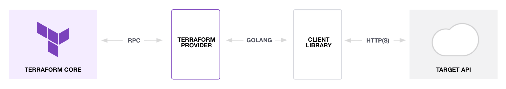

# Provider Terraform
<!-- .slide: class="page-title" -->


## Plan
<!-- .slide: class="toc" -->

- Système de plugin de Terraform
- Définition du provider
- Définition d'une ressource
    - méthodes create, read, update, delete
- Tester son provider en local
    - logs
- Tests automatisés
- Documentation & publication


### Système de plugin de Terraform (1/2)



- Core : provides common interface, and discovers...
- Plugins : executable binaries written in Go
    - mainly providers (also provisioners)
    - each plugin is specialized
    - the core communicates with them over gRPC (protocol v6 for tf 1.0).

Notes :
The gRPC protocol evolves (v6 for tf 1.0) and one shouldn't rely on it (no stability guarantee).
https://developer.hashicorp.com/terraform/plugin/how-terraform-works


### Système de plugin de Terraform (2/2)

When `terraform init` is run, Terraform:

- reads configuration files in the working directory to determine which plugins are necessary
- searches for installed plugins in several locations
    - sometimes downloads additional plugins
    - decides which plugin versions to use
    - writes a lock file

Terraform will read the lock file to ensure it uses the same plugin versions in this directory until `terraform init` is run again.


### Définition du provider

- Clone du repository template [https://github.com/hashicorp/terraform-provider-scaffolding-framework](https://github.com/hashicorp/terraform-provider-scaffolding-framework)

To create a provider, we can use the "plugin framework" (recommended, go module github.com/hashicorp/terraform-plugin-framework), or the older "plugin SDKv2".

Notes :
An adapter exists to migrate from SDKv2 to fwk


### Définition du provider : schéma

Les *schémas* permettent d'indiquer à Terraform le contenu attendu dans un block HCL.

```go
schema.Schema{
    Attributes: map[string]schema.Attribute{
        "folder_path": schema.StringAttribute{
            MarkdownDescription: "Folder containing the files",
            Required:            true,
        },
    },
}
```

pour

```terraform
provider "jsonfile" {
    folder_path = "/workspaces/go-tf-provider-lab/myquotes"
}
```


### Définition du provider : interface provider

```go
type Provider interface {
    // Metadata returns the name and version of the provider
	Metadata(context.Context, MetadataRequest, *MetadataResponse)

    // Schema returns what should be in the provider block in HCL files
	Schema(context.Context, SchemaRequest, *SchemaResponse)

	// Configure initializes API client (if any)
	Configure(context.Context, ConfigureRequest, *ConfigureResponse)

	// DataSources lists the datasources of the provider
	DataSources(context.Context) []func() datasource.DataSource

	// Resources lists the resources of the provider.
	Resources(context.Context) []func() resource.Resource
}
```

Notes :
Les 3 premières méthodes ont le même type de signature que des handlers HTTP
-> On développe bien un serveur (gRPC)


### Définition du provider : fichier main

```go
var version string = "dev"

func main() {
	opts := providerserver.ServeOpts{
		Address: "github.com/remieven/json-file",
	}

	err := providerserver.Serve(context.Background(), provider.New(version), opts)

	if err != nil {
		log.Fatal(err.Error())
	}
}
```


### Définition du provider

```go
/* This implements the framework's Provider interface. */
type JsonFileProvider struct {
	version string
}

/* Used by Terraform to parse the HCL block of the provider. */
/* Matches the provider's schema */
type JsonFileProviderModel struct {
	FolderPath types.String `tfsdk:"folder_path"`
}

/* Called at the beginning of the provider's lifecycle. */
func (p *JsonFileProvider) Configure(ctx context.Context, req provider.ConfigureRequest, resp *provider.ConfigureResponse) {
	var data JsonFileProviderModel
	resp.Diagnostics.Append(req.Config.Get(ctx, &data)...)
	if resp.Diagnostics.HasError() {
		return
	}

    // For this provider we don't initialize an API client;
    // instead, we fill ResourceData, which will be automatically to resources.
	resp.ResourceData = data.FolderPath.ValueString()
}

/* Other methods from the framework's Provider interface are omitted here. */
```


### Définition du provider : gestion des erreurs

```go
diagnostics := req.Config.Get(ctx, &data)
resp.Diagnostics.Append(diagnostics...)
if resp.Diagnostics.HasError() {
    return
}
```

Plutôt que de se baser sur le type `error` de la lib standard, on utilise des `diag.Diagnostic`.
Même principe (__errors as values__) mais permet d'accumuler plusieurs erreurs/warnings.

On peut créer ses propres diagnostics :

```go
diag.NewErrorDiagnostic(
    "failed to create quote",
    "failed to create quote: "+err.Error(),
)
```

Notes:
https://developer.hashicorp.com/terraform/plugin/framework/diagnostics


### Tester son provider en local (1/2)

- Vérifier la valeur de la variable d'environnement `$GOBIN` (ex: `/go/bin`)
- Depuis le dossier du provider, `go install .`.
    - À relancer à chaque fois qu'on modifie le code
- Dans `~/.terraformrc` :

```terraform
provider_installation {

  dev_overrides {
      "github.com/remieven/terraform-provider-json-file" = "/go/bin"
  }

  # For all other providers, install them directly from their origin provider
  # registries as normal. If you omit this, Terraform will _only_ use
  # the dev_overrides block, and so no other providers will be available.
  direct {}
}
```

Notes:
https://developer.hashicorp.com/terraform/tutorials/providers-plugin-framework/providers-plugin-framework-provider#prepare-terraform-for-local-provider-install


### Tester son provider en local (2/2)

On peut ensuite utiliser notre provider dans un projet :

```terraform
terraform {
  required_providers {
    jsonfile = {
      source = "github.com/remieven/json-file"
    }
  }
}

provider "jsonfile" {
    # configuration spécifique au provider
    folder_path = "/workspaces/go-tf-provider-lab/myquotes"
}
```


<!-- .slide: class="page-tp" data-label="TP : setup" -->


### Définition d'une ressource : interface resource

Comme pour le provider, on implémente une interface :

```go
type Resource interface {
	// Metadata returns the full name of the resource
	Metadata(context.Context, MetadataRequest, *MetadataResponse)

	// Schema returns the schema for this resource
	Schema(context.Context, SchemaRequest, *SchemaResponse)

    /* CRUD operations */
    Create(context.Context, CreateRequest, *CreateResponse)
	Read(context.Context, ReadRequest, *ReadResponse)
	Update(context.Context, UpdateRequest, *UpdateResponse)
	Delete(context.Context, DeleteRequest, *DeleteResponse)
}
```

Il y a des interfaces complémentaires qu'on peut également satisfaire pour implémenter des fonctionnalités plus avancées (ex: `ResourceWithImportState`, `ResourceWithModifyPlan`).


### Définition d'une ressource : exemple

```go
type QuoteResource struct {
	folderPath string
}

type QuoteResourceModel struct {
	Message types.String `tfsdk:"message"`
	Author  types.String `tfsdk:"author"`
	ID      types.String `tfsdk:"id"`
}

func (r *QuoteResource) Metadata(ctx context.Context, req resource.MetadataRequest, resp *resource.MetadataResponse) {
	resp.TypeName = req.ProviderTypeName + "_quote"
}
```


### Définition d'une ressource : méthode Create

```go
func (r *QuoteResource) Create(ctx context.Context, req resource.CreateRequest, resp *resource.CreateResponse) {
    /* Retrieve input data from request */
	var data QuoteResourceModel
	resp.Diagnostics.Append(req.Plan.Get(ctx, &data)...)
	if resp.Diagnostics.HasError() {
		return
	}

    /* Actually perform the resource creation */
	q := quote.Quote{ data.Message.ValueString() }
	id, err := quote.CreateQuoteFile(r.folderPath, q)
	if err != nil {
        diagnostic := diag.NewErrorDiagnostic(
            "failed to create quote",
            "failed to create quote: "+err.Error(),
        )
		resp.Diagnostics.Append(diagnostic)
		return
	}

    /* Complete input data with new fields and set it in the response */
	data.ID = types.StringValue(id)
	tflog.Trace(ctx, "created quote "+id)
	resp.Diagnostics.Append(resp.State.Set(ctx, &data)...)
}
```


### Définition d'une ressource : logs

Les plugins n'écrivent pas leurs logs eux-mêmes : c'est Terraform Core qui s'en charge.

Package `tflog` du framework : `tflog.Trace(ctx, "created quote "+id)`.

Par défaut, Terraform n'affiche aucun log des providers.
Il faut les activer avec par exemple `TF_LOG=TRACE`, `TF_LOG=ERROR`...

Notes :
Pour des cas plus complexes il est également possible de lancer son provider en debug avec delve, mais c'est difficile et ça a des effets de bord (car le cycle de vie du processus du plugin n'est plus géré par Terraform core).


<!-- .slide: class="page-tp" data-label="TP : resource" -->


### Définition d'une ressource : interfaces complémentaires

Pour permettre aux utilisateurs de votre provider d'importer des ressources créées en dehors de Terraform :

```go
type ResourceWithImportState interface {
	Resource
	ImportState(context.Context, ImportStateRequest, *ImportStateResponse)
}
```

```go
var _ resource.ResourceWithImportState = &QuoteResource{}

// ImportState implements resource.ResourceWithImportState.
func (r *QuoteResource) ImportState(ctx context.Context, req resource.ImportStateRequest, resp *resource.ImportStateResponse) {
    // We use a util function from the framework's resource package
	resource.ImportStatePassthroughID(ctx, path.Root("id"), req, resp)
}
```


<!-- .slide: class="page-tp" data-label="TP : resource import" -->


### Tests automatisés

Basé sur le système de tests unitaires de Go, mais avec une exécution contrôlée par un ensemble de fonctions utilitaires définies par le framework.

Les ressources sont vraiment créées : plus proche de tests d'intégration que des unitaires.
Par défaut, pour les lancer, il faut passer la variable d'environnement `TF_ACC=true` à `go test ./...`.

On donne une configuration terraform puis on fait des assertions sur le state.
Les ressources créées sont automatiquement supprimées à la fin.


### Documentation

- Bien remplir dans chaque schéma les champs `MarkdownDescription`.
- Ajouter des exemples de configuration dans le dossier `examples`

```
examples/
    provider/
        provider.tf
    resources/
        jsonfile_quote/
            resourcee.tf
```

Puis utiliser `hashicorp/terraform-plugin-docs/cmd` (souvent avec `go:generate`) pour générer les fichiers `.md` de la documentation.


<!-- .slide: class="page-tp" data-label="TP : documentation" -->


### Publication

See https://developer.hashicorp.com/terraform/registry/providers/publishing .


### Provider Terraform : pour aller plus loin

- [Documentation](https://developer.hashicorp.com/terraform/plugin)
- [Godoc du framework](https://pkg.go.dev/github.com/hashicorp/terraform-plugin-framework)
- [Tutoriel officiel](https://developer.hashicorp.com/terraform/tutorials/providers-plugin-framework) (~2h30)
